# Recipe Sharing Platform GraphQL TypeScript

This is a TypeScript-based GraphQL API for a recipe sharing platform. It allows users to query for recipes, search recipes by ingredients, and also enables them to submit their own recipes.

Developed a **GraphQL API** for a recipe sharing platform. Users can query for recipes, search by ingredients, and submit their own recipes.

## Features

- **Query recipes**: Users can query for recipes available on the platform.
- **Search by ingredients**: Users can search for recipes based on the ingredients they have.
- **Submit recipes**: Authenticated users can submit their own recipes to share with the community.

## Technologies Used

- **TypeScript**: The entire API is written in TypeScript to provide a strongly-typed development experience.
- **GraphQL**: The API is built using GraphQL to provide efficient and flexible data retrieval capabilities.
- **Node.js**: The API runs on Node.js to handle HTTP requests and serve the GraphQL endpoint.
- **Nestjs**: a popular open-source, back-end framework for Node. js and TypeScript-based, server-side applications.
- **Database**: MongoDB is used in order to get better performance due to tree structure like data.

## Getting Started

- Node.js (version v18.13.0 or higher)
- NPM (9.2.0)

## Installation

**Clone the repository:**

```bash
git clone https://github.com/BaseMax/RecipeSharingGraphQL
cd RecipeSharingGraphQL
```

**Install dependencies:**

```bash
npm install
```

**Set up environment variables:**

Create a `.env` file in the root directory and add the following environment variables:

```makefile
DB_URL=mongodb://your-mongodb-url
PORT=3000
```

**Run e2e test:**

- 1 : npm run test:auth

- 2 : npm run test:recipe

-3 : npm run test:comment

**Start the development server:**

```
npm run start:dev
```

The API will be accessible at `http://localhost:3000/graphql`.

## Additional GraphQL

**Popular Recipes Query:**

```graphql

query PopularRecipes($limit: Int!) {
        PopularRecipes(limit: $limit) {
          _id
          title
          numberOfLikes
        }
      };
```

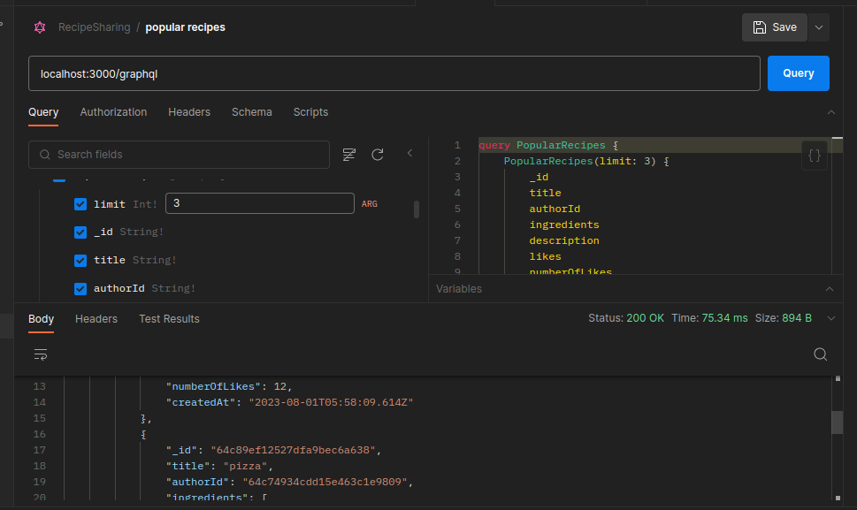

**Update Recipe Mutation:**

This mutation allows users to update their submitted recipes.

```graphql
 mutation UpdateRecipe($updateRecipeInput: UpdateRecipeInput!) {
      updateRecipe(updateRecipeInput: $updateRecipeInput) {
        authorId
        description
        title
        instructions {
          detail
          step
        }
        ingredients
        _id
      }
    };
```

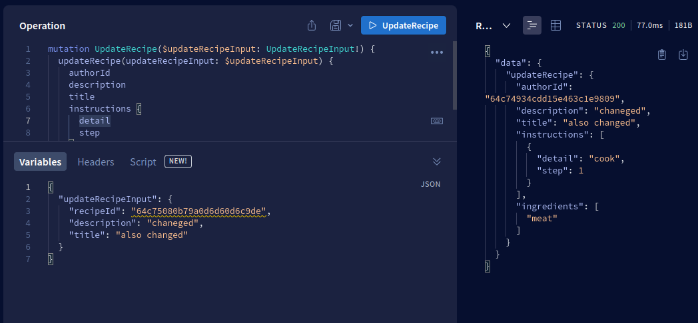

**Like Recipe Mutation:**

This mutation allows users to like a recipe.

```graphql

  mutation LikeRecipe($likeRecipeInput: UpdateRecipeInput!) {
      likeRecipe(likeRecipeInput: $likeRecipeInput) {
        title
        instructions {
          detail
          step
        }
        ingredients
        description
        authorId
        _id
        numberOfLikes
        likes
      }
    };
```

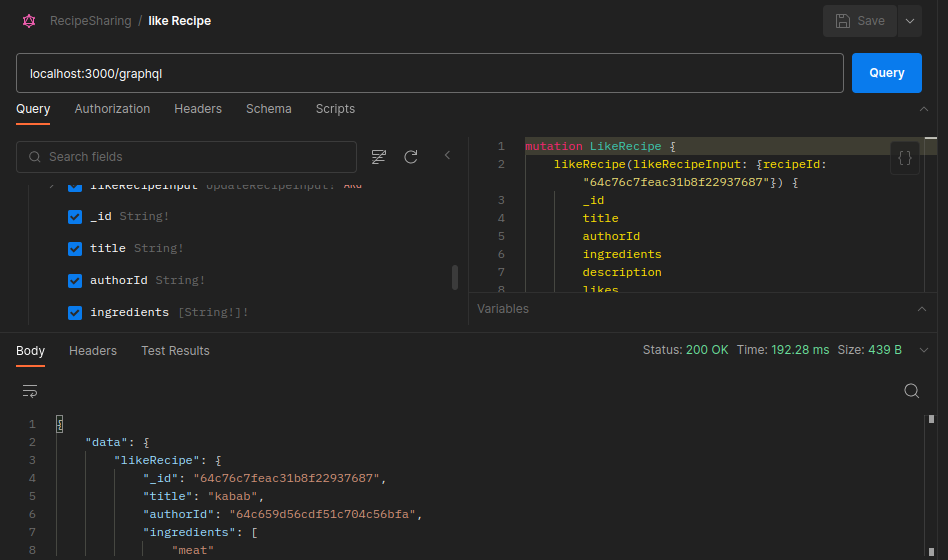

**Delete Recipe Mutation:**

This mutation allows users to delete their submitted recipes.

```graphql
mutation RemoveRecipe($removeRecipeInput: UpdateRecipeInput!) {
  removeRecipe(removeRecipeInput: $removeRecipeInput) {
    title
    likes
    numberOfLikes
    instructions {
      detail
      step
    }
    ingredients
    description
    _id
    authorId
  }
}
```

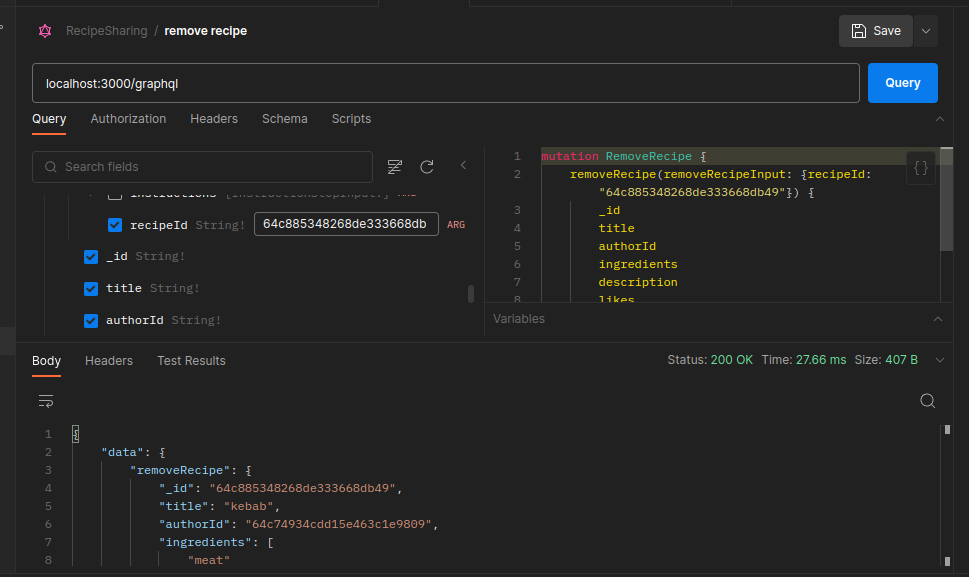

**User Registration Mutation:**

This mutation allows new users to register on the platform.

```graphql
mutation Signup {
  signup(
    signup: {
      email: "test2@gmail.com"
      name: "test"
      password: "password"
      confirmPassword: "${variables.password}"
    }
  ) {
    token
    name
  }
}
```

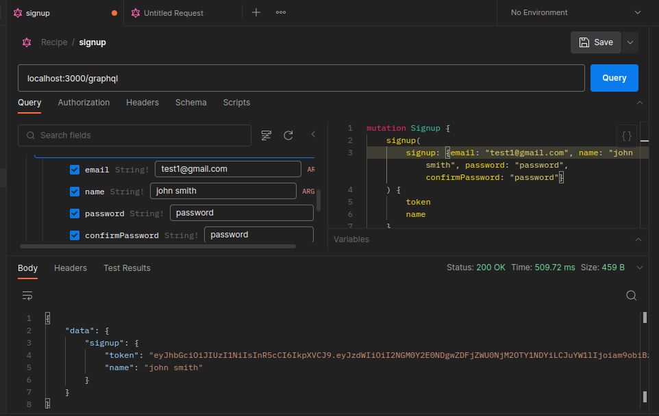

**User Login Mutation:**

This mutation allows users to log in to the platform and obtain an access token.

```graphql
mutation Login($login: LoginInput!) {
  login(login: $login) {
    token
    name
  }
}
```

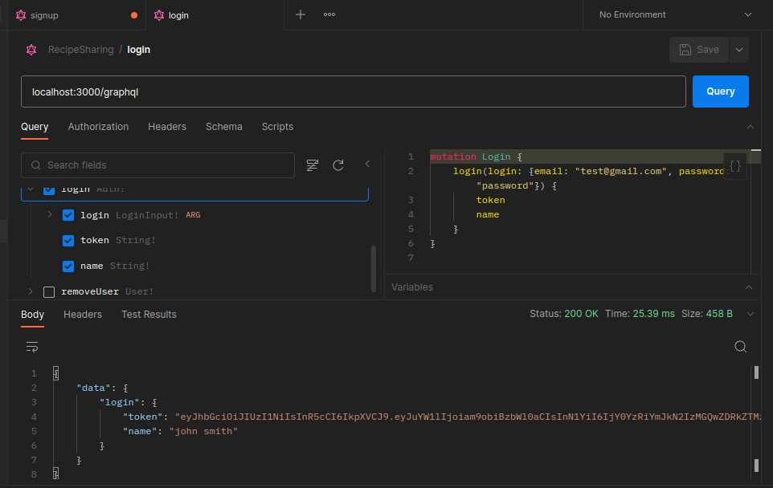

**Recent Recipes Query:**

This query returns a list of recently added recipes.

```graphql
query RecentRecipes($limit: Int!) {
  RecentRecipes(limit: $limit) {
    _id
    title
    createdAt
  }
}
```

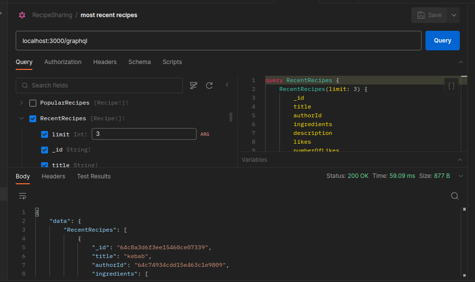

**Top Authors Query:**

This query returns a list of top authors based on their total recipes.

```graphql
query TopUsers($limit: Int!) {
        topUsers(limit: $limit) {
          email
          name
          createdAt
          recipes_count
          _id
        }
      }`
```

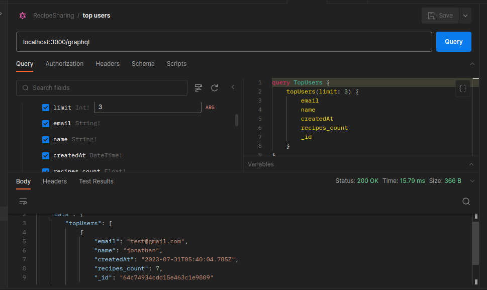

**Random Recipe Query:**

This query returns a random recipe from the platform.

```graphql
query RandomRecipe {
  randomRecipe {
    _id
    title
    authorId
    numberOfLikes
  }
}
```

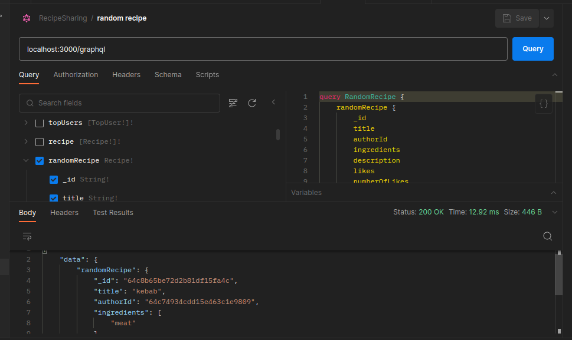

**Add Comment Mutation:**

This mutation allows users to add comments to a recipe.

```graphql
mutation CreateComment($createCommentInput: CreateCommentInput!) {
  createComment(createCommentInput: $createCommentInput) {
    content
    authorId
    recipeId
    createdAt
    _id
  }
}
```

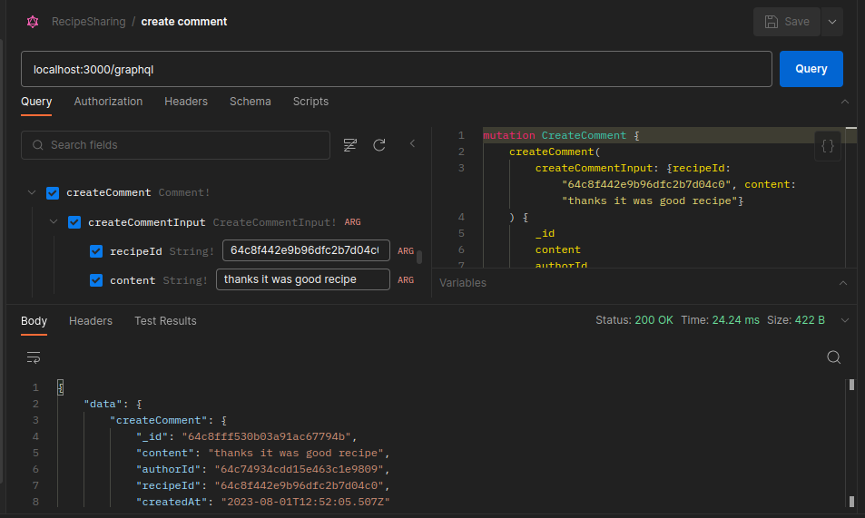

**Update Comment Mutation:**

This mutation allows users to update their own comments.

```graphql
mutation UpdateComment($updateCommentInput: UpdateCommentInput!) {
  updateComment(updateCommentInput: $updateCommentInput) {
    _id
    content
    authorId
    recipeId
    createdAt
  }
}
```

**Delete Comment Mutation:**

This mutation allows users to delete their own comments.

```graphql
mutation RemoveComment($deleteCommentInput: DeleteCommentInput!) {
  removeComment(deleteCommentInput: $deleteCommentInput) {
    _id
    content
    authorId
    recipeId
    createdAt
  }
}
```

**User Recipes Query:**

This query allows users to retrieve their own submitted recipes.

```graphql
query UserOwnRecipe {
  userOwnRecipe {
    _id
    title
    authorId
    createdAt
    numberOfLikes
  }
}
```

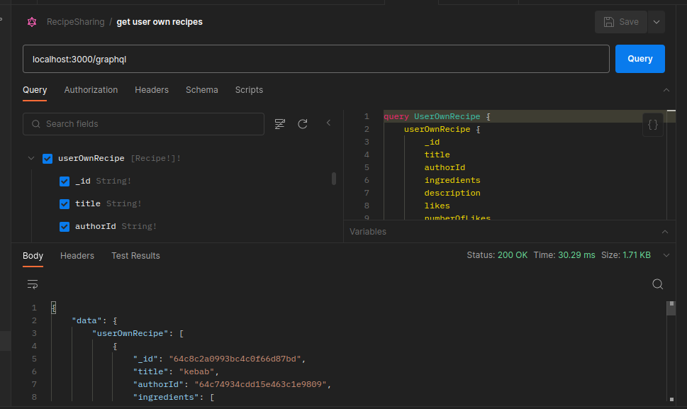

**Recommended Recipes Query:**

This query returns a list of recommended recipes based on the user's liked recipes .

```graphql
query UserFavoriteRecipes($limit: Int!) {
  userFavoriteRecipes(limit: $limit) {
    _id
    authorId
    likes
    createdAt
    title
  }
}
```

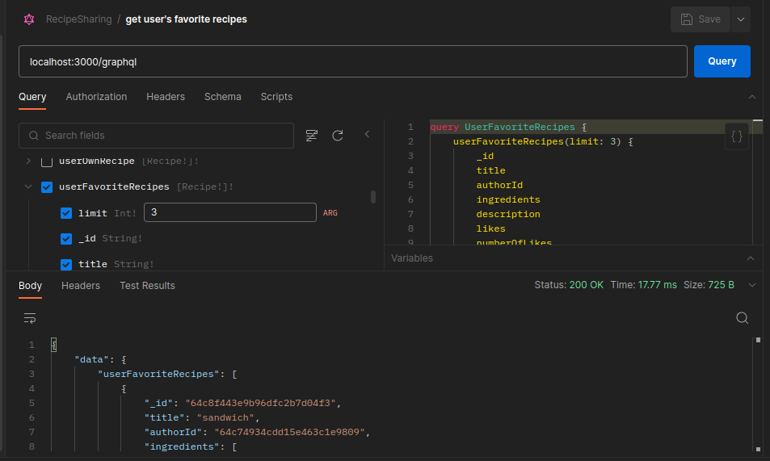


## Authentication

To enable user-specific functionality like submitting recipes, you need to implement authentication using tokens, OAuth, or any other authentication mechanism of your choice.

## API Reference

The GraphQL API provides the following queries and mutations.

### Queries:

- `recipes`: Retrieve a list of recipes.
- `recipe`: Get details of a specific recipe by ID.
- `searchRecipes`: Search for recipes based on ingredients.
- `popularRecipes`: Retrieve a list of popular recipes based on the number of likes and views.
- `recentRecipes`: Retrieve a list of recently added recipes.
- `topAuthors`: Retrieve a list of top authors based on their total likes and contributions.
- `randomRecipe`: Get a random recipe from the platform.
- `userRecipes`: Retrieve a list of recipes submitted by the authenticated user.
- `recommendedRecipes`: Retrieve a list of recommended recipes based on the user's liked recipes and followed authors.

### Mutations:

- `submitRecipe`: Submit a new recipe (requires authentication).
- `updateRecipe`: Update a recipe (requires authentication and ownership).
- `likeRecipe`: Like a recipe.
- `deleteRecipe`: Delete a recipe (requires authentication and ownership).
- `addComment`: Add a comment to a recipe (requires authentication).
- `updateComment`: Update a comment (requires authentication and ownership).

## Contributing

Contributions to this project are welcome! If you find any issues or want to add new features, feel free to submit a pull request.

- Fork the repository.
- Create a new branch for your feature or bug fix.
- Commit your changes and push the branch to your fork.
- Submit a pull request to the main repository.

## License

This project is licensed under the GPL-3.0 License. Feel free to use, modify, and distribute the code as per the terms of the license.

Copyright 2023, Max Base

Happy recipe sharing! 🍳🥗🍰
